# 动态规划题解

- [动态规划题解](#动态规划题解)
  - [分割整数](#分割整数)
    - [343. Integer Break](#343-integer-break)
    - [279. Perfect Squares](#279-perfect-squares)
    - [91. Decode Ways](#91-decode-ways)
  - [序列分割](#序列分割)
    - [300. Longest Increasing Subsequence](#300-longest-increasing-subsequence)
    - [646. Maximum Length of Pair Chain](#646-maximum-length-of-pair-chain)
    - [376. Wiggle Subsequence](#376-wiggle-subsequence)
  - [公共队列](#公共队列)
    - [1143. Longest Common Subsequence](#1143-longest-common-subsequence)
    - [longest Common Substring](#longest-common-substring)
  - [背包问题](#背包问题)
    - [0-1 背包问题](#0-1-背包问题)
    - [多维 0-1 背包问题](#多维-0-1-背包问题)
      - [474. Ones and Zeroes](#474-ones-and-zeroes)
    - [完全背包问题](#完全背包问题)
      - [322. Coin Change](#322-coin-change)

## 分割整数

### [343. Integer Break](https://leetcode.com/problems/integer-break/description/)

**描述**

Given an integer `n`, break it into the sum of **at least two positive integers** and maximize the product of those integers.

Return *the maximum product you can get*.

**解题思路**

动态规划思想，用`dp[i]`表示整数`i`分割数的最大乘积；

得到状态转移方程：

<div align="center">
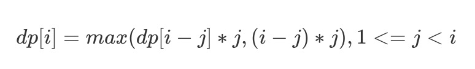
</div>

即首先将`i`分割成两部分：j和(i - j)，其中j表示不可分割整数数，(i - j)表示可分割整数，则dp[i]等于整数(i - j)的最大分割方式的乘积与整数j的乘积，得到dp[i] = max(dp[i - j] * j)，另外还需要考虑一种情况，就是不对(i - j)进行分割，得到dp[i] = (i - j) * j，最终得到以上方程；

边界条件：

当i = 1时，1 = 1 + 0，dp[1] = 1 * 0 = 0;

**代码实现**

```js
var integerBreak = function(n) {
    let dp = new Array(n + 1).fill(0);
    for (let i = 2; i <= n; i++) {
        for (let j = 1; j < i; j++) {
            dp[i] = Math.max(dp[i], Math.max(dp[i - j] * j, (i - j) * j));
        }
    }
    return dp[n];
};
```

### [279. Perfect Squares](https://leetcode.com/problems/perfect-squares/description/)

**描述**

Given an integer `n`, return *the least number of perfect square numbers that sum to* `n`.

A **perfect square** is an integer that is the square of an integer; in other words, it is the product of some integer with itself. For example, `1`, `4`, `9`, and `16` are perfect squares while `3` and `11` are not.

**解题思路**

动态规划思想，用`dp[i]`表示整数`i`最少分割平方数的数量；

得到状态转移方程：

<div align="center">
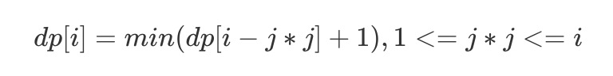
</div>

即将整数i分割成两部分：square和(i -square)，其中square表示一个平方数(j * j)，则dp[i]等于整数(i - j * j)的最少分割平方数的数量+1，然后比较以上所有的分割方式的分割数量大小，数量最少的分割方式为分割整数i的最优解。

边界条件：

当i = 0时, dp[0] = 0;

**代码实现**

```js
var numSquares = function(n) {
    let dp = new Array(n + 1).fill(0);
    dp[0] = 0;
    for (let i = 1; i <= n; i++) {
        let min = Number.MAX_SAFE_INTEGER;
        for (let j = 1; j * j <= i; j++) {
            min = Math.min(min, dp[i - j * j] + 1);
        }
        dp[i] = min;
    }
    return dp[n];
};
```

### [91. Decode Ways](https://leetcode.com/problems/decode-ways/description/)

**描述**

Given encoded message "12", it could be decoded as "AB" (1 2) or "L" (12).

**解题思路**

动态规划思想，用`dp[i]`表示前`i`个数字的解码方法数；

得到状态转移方程：

<div align="center">
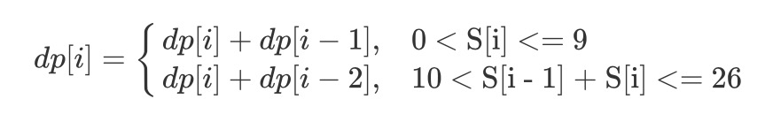
</div>

对于每个数字，只能有两种解码方式，即其本身或与其前一位数字组成的十位数。那么如果s[i]在[1-9]之间，dp[i] += dp[i - 1]，如果s[i - 1] + s[i]在[10-26]之间，dp[i] += dp[i - 2]（此处并未排除字符串s全是0的情况）。

**代码实现**

```js
var numDecodings = function(s) {
    if (s === null || s.length === 0) {
        return 0;
    }
    
    let n = s.length;
    let dp = new Array(n + 1).fill(0);
    dp[0] = 1;
    dp[1] = s.charAt(0) === '0' ? 0 : 1;
    for (let i = 2; i <= n; i++) {
        let one = parseInt(s.substring(i - 1, i));
        if (one !== 0) {
            dp[i] += dp[i - 1];
        }
        if (s.charAt(i - 2) === '0') {
            continue;
        }
        let two = parseInt(s.substring(i - 2, i));
        if (two <= 26) {
            dp[i] += dp[i - 2];
        }
    }
    return dp[n];
};
```

## 序列分割

### [300. Longest Increasing Subsequence](https://leetcode.com/problems/longest-increasing-subsequence/description/)

**描述**

Given an integer array `nums`, return the length of the longest strictly increasing subsequence.

A **subsequence** is a sequence that can be derived from an array by deleting some or no elements without changing the order of the remaining elements. For example, `[3,6,2,7]` is a subsequence of the array `[0,3,1,6,2,2,7]`.

**解题思路**

动态规划思想，用dp[i]表示以Si结尾的序列的最长递增子序列长度；

得到状态转移方程：

<div align="center">
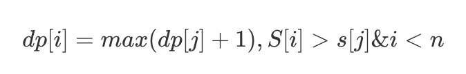
</div>

对于一个递增子序列{Si1, Si2,...,Sim-1, Sn}，如果im < n并且Sim < Sn, 此时{Si1, Si2,..., Sim, Sn} 为一个递增子序列，递增子序列的长度+1。因此dp[i]的最优解为max(dp[j] + 1 | Sj < Si, i < n)。

同时最长递增子序列并不一定以Sn为结尾，dp[n]不是最长递增子序列长度，序遍历dp数组找出最大值。

边界条件：

无论如何，以Si为结尾的序列中的递增子序列中至少包含Si，即dp[i]默认等于1。

**代码实现**

```js
var lengthOfLIS = function(nums) {
    let n = nums.length;
    let dp = new Array(n);
    for (let i = 0; i < n; i++) {
        let max = 1;
        for (let j = 0; j < i; j++) {
            if (nums[i] > nums[j]) {
                max = Math.max(max, dp[j] + 1);
            }
        }
        dp[i] = max;
    }
    return dp.reduce((pre, cur) => {
        return Math.max(pre, cur);
    }, 0);
};
```

### [646. Maximum Length of Pair Chain](https://leetcode.com/problems/maximum-length-of-pair-chain/description/)

**描述**

You are given `n` pairs of numbers. In every pair, the first number is always smaller than the second number.

Now, we define a pair `(c, d)` can follow another pair `(a, b)` if and only if `b < c`. Chain of pairs can be formed in this fashion.

Given a set of pairs, find the length longest chain which can be formed. You needn't use up all the given pairs. You can select pairs in any order.

**解题思路**

动态规划思想，用dp[i]表示以整数对Si为结尾的序列的最长链的长度。

得到状态转移方程：

<div align="center">
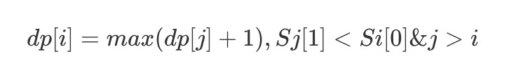
</div>

分析方法与上题差不多，具体不再进行赘述。

**代码实现**

```js
var findLongestChain = function(pairs) {
    if (pairs === null || pairs.length === 0) {
        return 0;
    }
    pairs.sort((a, b) => a[0] - b[0]);
    let n = pairs.length;
    let dp = new Array(n).fill(1);
    for (let i = 1; i < n; i++) {
        for (let j = 0; j < i; j++) {
            if (pairs[i][0] > pairs[j][1]) {
                dp[i] = Math.max(dp[i], dp[j] + 1);
            }
        }
    }
    return dp.reduce((pre, cur) => {
        return Math.max(pre, cur);
    }, 0);
};
```

### [376. Wiggle Subsequence](https://leetcode.com/problems/wiggle-subsequence/description/)

**描述**

Given a sequence of integers, return the length of the longest subsequence that is a wiggle sequence. A subsequence is obtained by deleting some number of elements (eventually, also zero) from the original sequence, leaving the remaining elements in their original order.

**解题思路**

动态规划思想，用up[i]和down[i]分别表示以nums[i]为上升结尾的最长摆动序列长度和以nums[i]为下降结尾的最长摆动序列长度。

得到状态转移方程：

<div align="center">
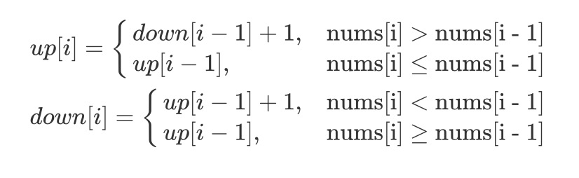
</div>

up[n]和down[n]中的最大值为最优解。

优化：用变量up和down分别缓存up[i - 1]和down[i - 1]的值。

**代码实现**

```js
var wiggleMaxLength = function(nums) {
    if (nums === null || nums.length === 0) {
        return 0;
    }
    let up = 1, down = 1;
    for (let i = 1; i < nums.length; i++) {
        if (nums[i] > nums[i - 1]) {
            up = down + 1;
        } else if (nums[i] < nums[i - 1]) {
            down = up + 1;
        }
    }
    return Math.max(up, down);
};
```

## 公共队列

### [1143. Longest Common Subsequence](https://leetcode.com/problems/longest-common-subsequence/)

**描述**

Given two strings `text1` and `text2`, return *the length of their longest **common subsequence**.* If there is no **common subsequence**, return `0`.

**解题思路**

动态规划思想，用二维数组`dp`储存最长公共子序列的长度，其中`dp[i][j]`表示 S1 的前 i 个字符与 S2 的前 j 个字符最长公共子序列的长度。

得到状态转移方程：

<div align="center">
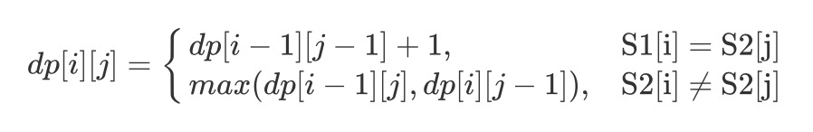
</div>

**代码实现**

```js
var longestCommonSubsequence = function(text1, text2) {
    let m = text1.length, n = text2.length;
    let dp = [new Array(n + 1).fill(0)];
    for (let i =  1; i <= m; i++) {
        dp[i] = [0];
        for (let j = 1; j <= n; j++) {
            if (text1[i - 1] === text2[j - 1]) {
                dp[i][j] = dp[i - 1][j - 1] + 1;
            } else {
                dp[i][j] = Math.max(dp[i - 1][j], dp[i][j - 1]);
            }
        }
    }
    return dp[m][n];
};
```

### longest Common Substring

**解题思路**

以以上公共子序列差不多，唯一不同的是当S1[i - 1] != S2[j - 1]时，dp[i][j]长度应该等于0；

得到状态转移方程：

<div align="center">
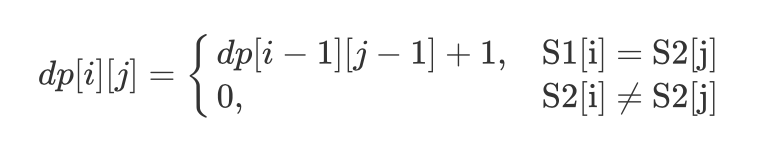
</div>

其中最长公共子串未必是以Sn为结尾，因此最长公共子串长度等于二维数组dp中的最大值。

**代码实现**

```js
var longestCommonSubstring = function(text1, text2) {
		let m = text1.length, n = text2.length;
  	let dp = [new Array(n + 1).fill(0)];
  	let max = 0;
  	for (let i = 1; i <= m; i++) {
        dp[i] = [0];
        for (let j = 1; j <= n; j++) {
            if (text1[i - 1] === text2[j - 1]) {
              	dp[i][j] = dp[i - 1][j - 1] + 1;
              	if (dp[i][j] > max) {
                  	max = dp[i][j];
                }
            } else {
              	dp[i][j] = 0;
            }
        }
    }
  	return max;
}
```

## 背包问题

### 0-1 背包问题

**描述**

有一个容量为 N 的背包，要用这个背包装下物品的价值最大，这些物品有两个属性：体积 w 和价值 v。

**解题思路**

定义一个二维数组 dp 存储最大价值，其中 dp[i][j] 表示前 i 件物品体积不超过 j 的情况下能达到的最大价值。设第 i 件物品体积为 w，价值为 v，根据第 i 件物品是否添加到背包中，可以分两种情况讨论：

* 第 i 件物品没添加到背包，总体积不超过 j 的前 i 件物品的最大价值就是总体积不超过 j 的前 i-1 件物品的最大价值，`dp[i][j] = dp[i-1][j]`;
* 第 i 件物品添加到背包中，`dp[i][j] = dp[i-1][j-w] + v`;

取两种情况中价值最大的为最优解。

得到状态转移方程：

<div align="center">
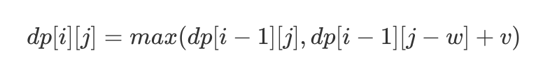
</div>

空间优化：

由于前 i 件物品的状态仅与前 i-1 件物品的状态有关，因此定义一维数组dp，

其中dp[j]既可以表示`dp[i-1][j]`也可以表示`dp[i][j]`，此状态转移方程为：

<div align="center">
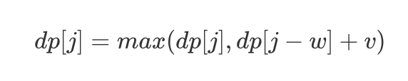
</div>

**代码实现**

```js
var knapsack = function(W, N, weights, values) {
  	let dp = new Array(W + 1).fill(0);
  	for (let i = 1; i <= N; i++) {
    		let w = weights[i - 1], v = values[i - 1];
      	for (let j = W; j >= 1; j--) {
          	if (j >= w) {
              	dp[j] = Math.max(dp[j], dp[j - w] + v);
            }
        }
    }
  	return dp[W];
}
```

### 多维 0-1 背包问题

#### [474. Ones and Zeroes](https://leetcode.com/problems/ones-and-zeroes/description/)

**描述**

You are given an array of binary strings `strs` and two integers `m` and `n`.

Return *the size of the largest subset of `strs` such that there are **at most*** `m` `0`*'s and* `n` `1`*'s in the subset*.

**解题思路**

动态规划思想，定义两个二维数组`dp`，其中`dp[k][i]`表示以Sk为结尾的子序列 0 个数不超过 i 的情况下能够容纳最多的字符串数量，`dp[k][j]`表示以Sk为结尾的序列1个数不超过j的情况下能够容纳最多的字符串数量。

得到状态转移方程：

<div align="center">
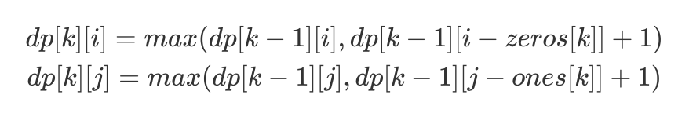
</div>

空间优化：

由于前 k 个字符串的状态仅与前 k-1 个字符串有关，因此定义一个二维数组，其中`dp[i][j]`分别可以表示`dp[k-1][i]`、`dp[k][i]`、`dp[k-1][j]`和`dp[k][j]`，状态转移方程为：

<div align="center">
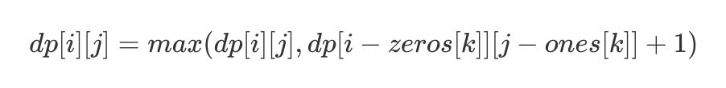
</div>

**代码实现**

```js
var findMaxForm = function(strs, m, n) {
    if (strs === null || strs.length === 0) {
        return 0;
    }
    let dp = Array(m + 1).fill(0).map(() => Array(n + 1).fill(0));
    for (let str of strs) {
        let zeros = 0, ones = 0;
        for (let c of str) {
            if (c === '0') {
                zeros++;
            } else {
                ones++;
            }
        }
        for (let i = m; i >= zeros; i--) {
            for (let j = n; j >= ones; j--) {
                dp[i][j] = Math.max(dp[i][j], dp[i - zeros][j - ones] + 1);
            }
        }
    }
    return dp[m][n];
};
```

### 完全背包问题

#### [322. Coin Change](https://leetcode.com/problems/coin-change/description/)

**描述**

You are given coins of different denominations and a total amount of money *amount*. Write a function to compute the fewest number of coins that you need to make up that amount. If that amount of money cannot be made up by any combination of the coins, return `-1`.

**解题思路**

硬币可以重复使用，属于完全背包问题，定义一个二维数组`dp`，其中`dp[k][i]`表示前k种硬币在价值超过`i`的情况下以最少的硬币组合出最大的价值，第`k``种硬币是否组合进来分 3 种情况：

* 当第 k 种硬币大于总值 i 时，`dp[k][i] = dp[k-1][i]`；
* 当第 k 种硬币等于总值 i 时，`dp[k][i] =1`；
* 当第 k 种硬币小于总值 i 时，`dp[k][i] = min(dp[k][i - k], dp[k][i - k] + 1)`，注意开始`dp[k][i] = 0`时，`dp[k][i] = dp[k][i - coin] + 1`；

**代码实现**

```js
var coinChange = function(coins, amount) {
    if (coins === null || amount === 0) {
        return 0;
    }
    let dp = new Array(amount + 1).fill(0);
    for (let coin of coins) {
        for (let i = coin; i <= amount; i++) {
            if (i === coin) {
                dp[i] = 1;
            } else if (dp[i] === 0 && dp[i - coin] !== 0) {
                dp[i] = dp[i - coin] + 1;
            } else if (dp[i - coin] !== 0) {
                dp[i] = Math.min(dp[i], dp[i - coin] + 1);
            }
        }
    }
    return dp[amount] === 0 ? -1 : dp[amount];
};
```

​	